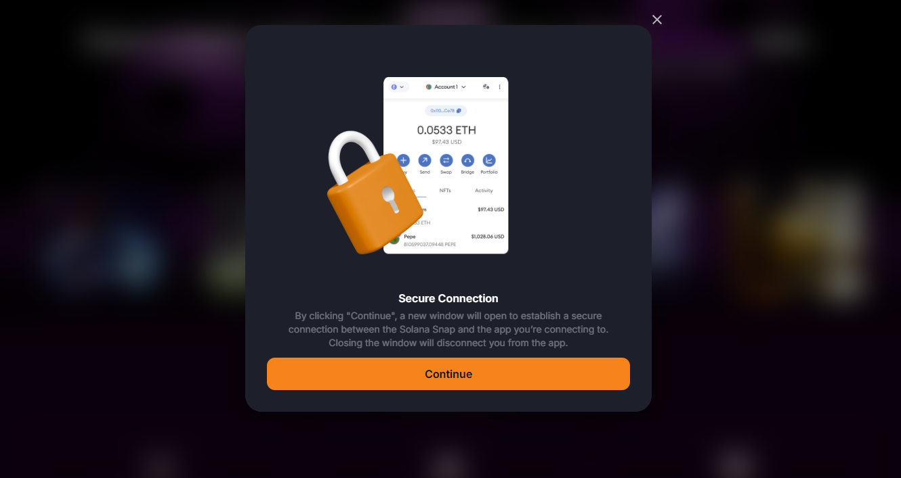
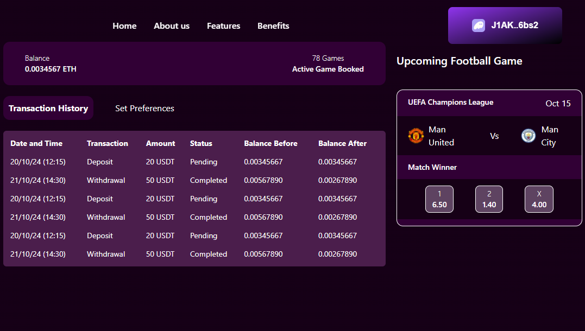

# Sports Betting Platform

## Overview
This Sports Betting App is built using **Node.js** and integrates with a cryptocurrency wallet to facilitate secure and seamless betting experiences. The application allows users to place bets on various sports events, track their betting history, and manage their wallet balances.

## Features
- **User Authentication:** Secure login and registration for users.
- **Event Listings:** View upcoming sports events available for betting.
- **Betting Functionality:** Place bets on selected events with real-time odds.
- **Wallet Integration:** Connects to a cryptocurrency wallet for deposits and withdrawals.
- **Betting History:** Track past bets and their outcomes.
- **Responsive Design:** User-friendly interface for both desktop and mobile devices.

## Technologies Used
- **Node.js:** Backend server for handling requests and managing data.
- **Express.js:** Web framework for building the application.
- **MongoDB:** Database for storing user data, event information, and betting history.
- **Web3.js:** Library for interacting with the cryptocurrency wallet.
- **React.js:** Frontend library for building the user interface.

## Installation

### Prerequisites
- Node.js (v16 or higher)
- MongoDB (local or cloud instance)
- A cryptocurrency wallet (e.g., MetaMask)

### Steps
1. **Clone the repository:**
   ```bash
   git clone https://github.com/Capybara003/Sport-Betting-platform.git
   cd Sport-Betting-platform
    ```
2. **Install dependencies:**
    ```bash
    npm install
    ```
3. **Start the server:**
    ```bash
    npm start
    ```
4. **Access the application:**
    Open your browser and navigate to `http://localhost:3000`.

## Usage

- `Register/Login:` Create an account or log in to access betting features.
- `Connect Wallet:` Integrate your cryptocurrency wallet to manage funds.
- `Place Bets:` Select a sporting event and enter your bet amount.
- `View History:` Check your betting history to analyze past performance.

## UI

1. **User Interface Screenshot:**


2. **Wallet Integration Flow:**


3. **Betting Result:**


## Contributing

Contributions are welcome! Please fork the repository and submit a pull request with your changes.
